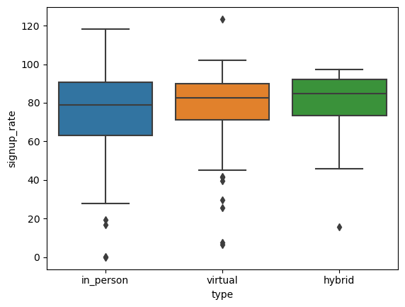
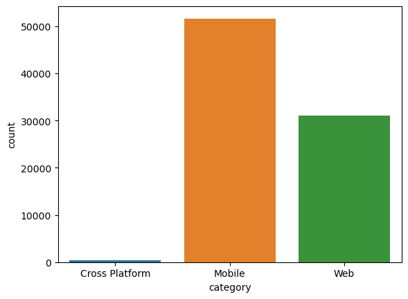
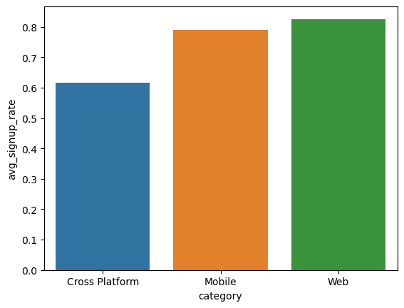
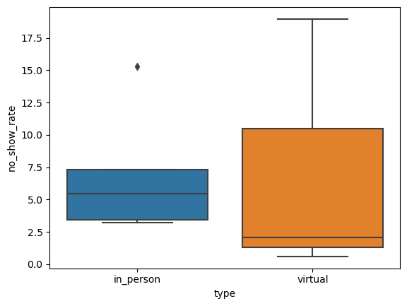
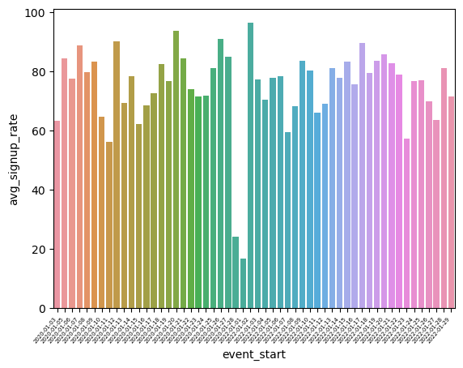

# Goal: Explore the pattern of sign-up rates across different events.

## Set up SQLite connection


```python
import sqlite3
from sqlite3 import Error

def create_connection(db_file):
  conn = None
  try:
      conn = sqlite3.connect(db_file)
  except Error as e:
      print("create_connection error:")
      print(e)
  return conn

def execute_query(conn, query):
  return pd.read_sql_query(query,conn)

def display_result(r):
  display(r.style.hide(axis='index'))

conn1 = create_connection('case_study.db')
```


```python
conn1 = create_connection('case_study.db')
r = execute_query(conn1, "SELECT type, COUNT(*) FROM event GROUP BY type")
display_result(r)
```


<style type="text/css">
</style>
<table id="T_4d6b1">
  <thead>
    <tr>
      <th id="T_4d6b1_level0_col0" class="col_heading level0 col0" >type</th>
      <th id="T_4d6b1_level0_col1" class="col_heading level0 col1" >COUNT(*)</th>
    </tr>
  </thead>
  <tbody>
    <tr>
      <td id="T_4d6b1_row0_col0" class="data row0 col0" >hybrid</td>
      <td id="T_4d6b1_row0_col1" class="data row0 col1" >35</td>
    </tr>
    <tr>
      <td id="T_4d6b1_row1_col0" class="data row1 col0" >in_person</td>
      <td id="T_4d6b1_row1_col1" class="data row1 col1" >169</td>
    </tr>
    <tr>
      <td id="T_4d6b1_row2_col0" class="data row2 col0" >virtual</td>
      <td id="T_4d6b1_row2_col1" class="data row2 col1" >115</td>
    </tr>
  </tbody>
</table>


## Import python packages


```python
import pandas as pd
import matplotlib.pyplot as plt
import seaborn as sns
```

## Beginning Exploration
After looking over the databse in SQLiteStudio, there are several things to note:
- 319 total events
- 3 distinct event types (in-person, virtual, hybrid)
- 83089 users

## Calculate sign-up rate per event
Converted sign_ups from text to float in order to calculate the sign-up rate. Set output to first 50 rows to get an overview of what the calculations look like.


```python
query1='''
SELECT event_id, type, CAST(sign_ups AS FLOAT) / size * 100 AS signup_rate FROM event
GROUP BY event_id;
'''
r = execute_query(conn1,query1)
display_result(r.head(55))
```


<style type="text/css">
</style>
<table id="T_f8adc">
  <thead>
    <tr>
      <th id="T_f8adc_level0_col0" class="col_heading level0 col0" >event_id</th>
      <th id="T_f8adc_level0_col1" class="col_heading level0 col1" >type</th>
      <th id="T_f8adc_level0_col2" class="col_heading level0 col2" >signup_rate</th>
    </tr>
  </thead>
  <tbody>
    <tr>
      <td id="T_f8adc_row0_col0" class="data row0 col0" >EVT_0001</td>
      <td id="T_f8adc_row0_col1" class="data row0 col1" >in_person</td>
      <td id="T_f8adc_row0_col2" class="data row0 col2" >105.755396</td>
    </tr>
    <tr>
      <td id="T_f8adc_row1_col0" class="data row1 col0" >EVT_0002</td>
      <td id="T_f8adc_row1_col1" class="data row1 col1" >in_person</td>
      <td id="T_f8adc_row1_col2" class="data row1 col2" >62.857143</td>
    </tr>
    <tr>
      <td id="T_f8adc_row2_col0" class="data row2 col0" >EVT_0003</td>
      <td id="T_f8adc_row2_col1" class="data row2 col1" >in_person</td>
      <td id="T_f8adc_row2_col2" class="data row2 col2" >63.877551</td>
    </tr>
    <tr>
      <td id="T_f8adc_row3_col0" class="data row3 col0" >EVT_0004</td>
      <td id="T_f8adc_row3_col1" class="data row3 col1" >in_person</td>
      <td id="T_f8adc_row3_col2" class="data row3 col2" >91.397849</td>
    </tr>
    <tr>
      <td id="T_f8adc_row4_col0" class="data row4 col0" >EVT_0005</td>
      <td id="T_f8adc_row4_col1" class="data row4 col1" >in_person</td>
      <td id="T_f8adc_row4_col2" class="data row4 col2" >88.421053</td>
    </tr>
    <tr>
      <td id="T_f8adc_row5_col0" class="data row5 col0" >EVT_0006</td>
      <td id="T_f8adc_row5_col1" class="data row5 col1" >in_person</td>
      <td id="T_f8adc_row5_col2" class="data row5 col2" >87.058824</td>
    </tr>
    <tr>
      <td id="T_f8adc_row6_col0" class="data row6 col0" >EVT_0007</td>
      <td id="T_f8adc_row6_col1" class="data row6 col1" >in_person</td>
      <td id="T_f8adc_row6_col2" class="data row6 col2" >91.296296</td>
    </tr>
    <tr>
      <td id="T_f8adc_row7_col0" class="data row7 col0" >EVT_0008</td>
      <td id="T_f8adc_row7_col1" class="data row7 col1" >in_person</td>
      <td id="T_f8adc_row7_col2" class="data row7 col2" >46.015038</td>
    </tr>
    <tr>
      <td id="T_f8adc_row8_col0" class="data row8 col0" >EVT_0009</td>
      <td id="T_f8adc_row8_col1" class="data row8 col1" >in_person</td>
      <td id="T_f8adc_row8_col2" class="data row8 col2" >96.067416</td>
    </tr>
    <tr>
      <td id="T_f8adc_row9_col0" class="data row9 col0" >EVT_0010</td>
      <td id="T_f8adc_row9_col1" class="data row9 col1" >in_person</td>
      <td id="T_f8adc_row9_col2" class="data row9 col2" >89.600000</td>
    </tr>
    <tr>
      <td id="T_f8adc_row10_col0" class="data row10 col0" >EVT_0011</td>
      <td id="T_f8adc_row10_col1" class="data row10 col1" >in_person</td>
      <td id="T_f8adc_row10_col2" class="data row10 col2" >89.855072</td>
    </tr>
    <tr>
      <td id="T_f8adc_row11_col0" class="data row11 col0" >EVT_0012</td>
      <td id="T_f8adc_row11_col1" class="data row11 col1" >in_person</td>
      <td id="T_f8adc_row11_col2" class="data row11 col2" >31.858407</td>
    </tr>
    <tr>
      <td id="T_f8adc_row12_col0" class="data row12 col0" >EVT_0013</td>
      <td id="T_f8adc_row12_col1" class="data row12 col1" >in_person</td>
      <td id="T_f8adc_row12_col2" class="data row12 col2" >92.546584</td>
    </tr>
    <tr>
      <td id="T_f8adc_row13_col0" class="data row13 col0" >EVT_0014</td>
      <td id="T_f8adc_row13_col1" class="data row13 col1" >in_person</td>
      <td id="T_f8adc_row13_col2" class="data row13 col2" >71.047228</td>
    </tr>
    <tr>
      <td id="T_f8adc_row14_col0" class="data row14 col0" >EVT_0015</td>
      <td id="T_f8adc_row14_col1" class="data row14 col1" >in_person</td>
      <td id="T_f8adc_row14_col2" class="data row14 col2" >85.840708</td>
    </tr>
    <tr>
      <td id="T_f8adc_row15_col0" class="data row15 col0" >EVT_0016</td>
      <td id="T_f8adc_row15_col1" class="data row15 col1" >in_person</td>
      <td id="T_f8adc_row15_col2" class="data row15 col2" >79.134860</td>
    </tr>
    <tr>
      <td id="T_f8adc_row16_col0" class="data row16 col0" >EVT_0017</td>
      <td id="T_f8adc_row16_col1" class="data row16 col1" >in_person</td>
      <td id="T_f8adc_row16_col2" class="data row16 col2" >91.566265</td>
    </tr>
    <tr>
      <td id="T_f8adc_row17_col0" class="data row17 col0" >EVT_0018</td>
      <td id="T_f8adc_row17_col1" class="data row17 col1" >in_person</td>
      <td id="T_f8adc_row17_col2" class="data row17 col2" >90.909091</td>
    </tr>
    <tr>
      <td id="T_f8adc_row18_col0" class="data row18 col0" >EVT_0019</td>
      <td id="T_f8adc_row18_col1" class="data row18 col1" >in_person</td>
      <td id="T_f8adc_row18_col2" class="data row18 col2" >77.464789</td>
    </tr>
    <tr>
      <td id="T_f8adc_row19_col0" class="data row19 col0" >EVT_0020</td>
      <td id="T_f8adc_row19_col1" class="data row19 col1" >in_person</td>
      <td id="T_f8adc_row19_col2" class="data row19 col2" >97.955707</td>
    </tr>
    <tr>
      <td id="T_f8adc_row20_col0" class="data row20 col0" >EVT_0021</td>
      <td id="T_f8adc_row20_col1" class="data row20 col1" >in_person</td>
      <td id="T_f8adc_row20_col2" class="data row20 col2" >89.361702</td>
    </tr>
    <tr>
      <td id="T_f8adc_row21_col0" class="data row21 col0" >EVT_0022</td>
      <td id="T_f8adc_row21_col1" class="data row21 col1" >in_person</td>
      <td id="T_f8adc_row21_col2" class="data row21 col2" >85.294118</td>
    </tr>
    <tr>
      <td id="T_f8adc_row22_col0" class="data row22 col0" >EVT_0023</td>
      <td id="T_f8adc_row22_col1" class="data row22 col1" >in_person</td>
      <td id="T_f8adc_row22_col2" class="data row22 col2" >92.134831</td>
    </tr>
    <tr>
      <td id="T_f8adc_row23_col0" class="data row23 col0" >EVT_0024</td>
      <td id="T_f8adc_row23_col1" class="data row23 col1" >in_person</td>
      <td id="T_f8adc_row23_col2" class="data row23 col2" >52.517986</td>
    </tr>
    <tr>
      <td id="T_f8adc_row24_col0" class="data row24 col0" >EVT_0025</td>
      <td id="T_f8adc_row24_col1" class="data row24 col1" >in_person</td>
      <td id="T_f8adc_row24_col2" class="data row24 col2" >98.039216</td>
    </tr>
    <tr>
      <td id="T_f8adc_row25_col0" class="data row25 col0" >EVT_0026</td>
      <td id="T_f8adc_row25_col1" class="data row25 col1" >in_person</td>
      <td id="T_f8adc_row25_col2" class="data row25 col2" >78.969957</td>
    </tr>
    <tr>
      <td id="T_f8adc_row26_col0" class="data row26 col0" >EVT_0027</td>
      <td id="T_f8adc_row26_col1" class="data row26 col1" >in_person</td>
      <td id="T_f8adc_row26_col2" class="data row26 col2" >86.725664</td>
    </tr>
    <tr>
      <td id="T_f8adc_row27_col0" class="data row27 col0" >EVT_0028</td>
      <td id="T_f8adc_row27_col1" class="data row27 col1" >in_person</td>
      <td id="T_f8adc_row27_col2" class="data row27 col2" >94.915254</td>
    </tr>
    <tr>
      <td id="T_f8adc_row28_col0" class="data row28 col0" >EVT_0029</td>
      <td id="T_f8adc_row28_col1" class="data row28 col1" >in_person</td>
      <td id="T_f8adc_row28_col2" class="data row28 col2" >55.409836</td>
    </tr>
    <tr>
      <td id="T_f8adc_row29_col0" class="data row29 col0" >EVT_0030</td>
      <td id="T_f8adc_row29_col1" class="data row29 col1" >in_person</td>
      <td id="T_f8adc_row29_col2" class="data row29 col2" >85.806452</td>
    </tr>
    <tr>
      <td id="T_f8adc_row30_col0" class="data row30 col0" >EVT_0031</td>
      <td id="T_f8adc_row30_col1" class="data row30 col1" >in_person</td>
      <td id="T_f8adc_row30_col2" class="data row30 col2" >41.538462</td>
    </tr>
    <tr>
      <td id="T_f8adc_row31_col0" class="data row31 col0" >EVT_0032</td>
      <td id="T_f8adc_row31_col1" class="data row31 col1" >in_person</td>
      <td id="T_f8adc_row31_col2" class="data row31 col2" >74.036511</td>
    </tr>
    <tr>
      <td id="T_f8adc_row32_col0" class="data row32 col0" >EVT_0033</td>
      <td id="T_f8adc_row32_col1" class="data row32 col1" >in_person</td>
      <td id="T_f8adc_row32_col2" class="data row32 col2" >78.461538</td>
    </tr>
    <tr>
      <td id="T_f8adc_row33_col0" class="data row33 col0" >EVT_0034</td>
      <td id="T_f8adc_row33_col1" class="data row33 col1" >in_person</td>
      <td id="T_f8adc_row33_col2" class="data row33 col2" >55.648536</td>
    </tr>
    <tr>
      <td id="T_f8adc_row34_col0" class="data row34 col0" >EVT_0035</td>
      <td id="T_f8adc_row34_col1" class="data row34 col1" >in_person</td>
      <td id="T_f8adc_row34_col2" class="data row34 col2" >34.177215</td>
    </tr>
    <tr>
      <td id="T_f8adc_row35_col0" class="data row35 col0" >EVT_0036</td>
      <td id="T_f8adc_row35_col1" class="data row35 col1" >in_person</td>
      <td id="T_f8adc_row35_col2" class="data row35 col2" >79.026217</td>
    </tr>
    <tr>
      <td id="T_f8adc_row36_col0" class="data row36 col0" >EVT_0037</td>
      <td id="T_f8adc_row36_col1" class="data row36 col1" >in_person</td>
      <td id="T_f8adc_row36_col2" class="data row36 col2" >91.025641</td>
    </tr>
    <tr>
      <td id="T_f8adc_row37_col0" class="data row37 col0" >EVT_0038</td>
      <td id="T_f8adc_row37_col1" class="data row37 col1" >in_person</td>
      <td id="T_f8adc_row37_col2" class="data row37 col2" >87.500000</td>
    </tr>
    <tr>
      <td id="T_f8adc_row38_col0" class="data row38 col0" >EVT_0039</td>
      <td id="T_f8adc_row38_col1" class="data row38 col1" >in_person</td>
      <td id="T_f8adc_row38_col2" class="data row38 col2" >91.637631</td>
    </tr>
    <tr>
      <td id="T_f8adc_row39_col0" class="data row39 col0" >EVT_0040</td>
      <td id="T_f8adc_row39_col1" class="data row39 col1" >in_person</td>
      <td id="T_f8adc_row39_col2" class="data row39 col2" >74.798387</td>
    </tr>
    <tr>
      <td id="T_f8adc_row40_col0" class="data row40 col0" >EVT_0041</td>
      <td id="T_f8adc_row40_col1" class="data row40 col1" >in_person</td>
      <td id="T_f8adc_row40_col2" class="data row40 col2" >97.272727</td>
    </tr>
    <tr>
      <td id="T_f8adc_row41_col0" class="data row41 col0" >EVT_0042</td>
      <td id="T_f8adc_row41_col1" class="data row41 col1" >in_person</td>
      <td id="T_f8adc_row41_col2" class="data row41 col2" >93.534483</td>
    </tr>
    <tr>
      <td id="T_f8adc_row42_col0" class="data row42 col0" >EVT_0043</td>
      <td id="T_f8adc_row42_col1" class="data row42 col1" >in_person</td>
      <td id="T_f8adc_row42_col2" class="data row42 col2" >76.628352</td>
    </tr>
    <tr>
      <td id="T_f8adc_row43_col0" class="data row43 col0" >EVT_0044</td>
      <td id="T_f8adc_row43_col1" class="data row43 col1" >in_person</td>
      <td id="T_f8adc_row43_col2" class="data row43 col2" >0.000000</td>
    </tr>
    <tr>
      <td id="T_f8adc_row44_col0" class="data row44 col0" >EVT_0045</td>
      <td id="T_f8adc_row44_col1" class="data row44 col1" >in_person</td>
      <td id="T_f8adc_row44_col2" class="data row44 col2" >53.367876</td>
    </tr>
    <tr>
      <td id="T_f8adc_row45_col0" class="data row45 col0" >EVT_0046</td>
      <td id="T_f8adc_row45_col1" class="data row45 col1" >in_person</td>
      <td id="T_f8adc_row45_col2" class="data row45 col2" >89.542484</td>
    </tr>
    <tr>
      <td id="T_f8adc_row46_col0" class="data row46 col0" >EVT_0047</td>
      <td id="T_f8adc_row46_col1" class="data row46 col1" >in_person</td>
      <td id="T_f8adc_row46_col2" class="data row46 col2" >95.580110</td>
    </tr>
    <tr>
      <td id="T_f8adc_row47_col0" class="data row47 col0" >EVT_0048</td>
      <td id="T_f8adc_row47_col1" class="data row47 col1" >in_person</td>
      <td id="T_f8adc_row47_col2" class="data row47 col2" >87.078652</td>
    </tr>
    <tr>
      <td id="T_f8adc_row48_col0" class="data row48 col0" >EVT_0049</td>
      <td id="T_f8adc_row48_col1" class="data row48 col1" >in_person</td>
      <td id="T_f8adc_row48_col2" class="data row48 col2" >90.756303</td>
    </tr>
    <tr>
      <td id="T_f8adc_row49_col0" class="data row49 col0" >EVT_0050</td>
      <td id="T_f8adc_row49_col1" class="data row49 col1" >in_person</td>
      <td id="T_f8adc_row49_col2" class="data row49 col2" >69.158879</td>
    </tr>
    <tr>
      <td id="T_f8adc_row50_col0" class="data row50 col0" >EVT_0051</td>
      <td id="T_f8adc_row50_col1" class="data row50 col1" >in_person</td>
      <td id="T_f8adc_row50_col2" class="data row50 col2" >53.846154</td>
    </tr>
    <tr>
      <td id="T_f8adc_row51_col0" class="data row51 col0" >EVT_0052</td>
      <td id="T_f8adc_row51_col1" class="data row51 col1" >in_person</td>
      <td id="T_f8adc_row51_col2" class="data row51 col2" >67.333333</td>
    </tr>
    <tr>
      <td id="T_f8adc_row52_col0" class="data row52 col0" >EVT_0053</td>
      <td id="T_f8adc_row52_col1" class="data row52 col1" >in_person</td>
      <td id="T_f8adc_row52_col2" class="data row52 col2" >83.969466</td>
    </tr>
    <tr>
      <td id="T_f8adc_row53_col0" class="data row53 col0" >EVT_0054</td>
      <td id="T_f8adc_row53_col1" class="data row53 col1" >in_person</td>
      <td id="T_f8adc_row53_col2" class="data row53 col2" >71.602434</td>
    </tr>
    <tr>
      <td id="T_f8adc_row54_col0" class="data row54 col0" >EVT_0055</td>
      <td id="T_f8adc_row54_col1" class="data row54 col1" >in_person</td>
      <td id="T_f8adc_row54_col2" class="data row54 col2" >67.261905</td>
    </tr>
  </tbody>
</table>


```python
# store sign-up rates into dataframe 
df_rate = pd.read_sql(query1, conn1)
```


```python
# finding the lowest and highest sign-up rate
query2 = '''
SELECT MIN(CAST(sign_ups AS FLOAT)/size), MAX(CAST(sign_ups AS FLOAT)/size) FROM event;
'''
r = execute_query(conn1,query2)
display_result(r)
```


<style type="text/css">
</style>
<table id="T_eb55f">
  <thead>
    <tr>
      <th id="T_eb55f_level0_col0" class="col_heading level0 col0" >MIN(CAST(sign_ups AS FLOAT)/size)</th>
      <th id="T_eb55f_level0_col1" class="col_heading level0 col1" >MAX(CAST(sign_ups AS FLOAT)/size)</th>
    </tr>
  </thead>
  <tbody>
    <tr>
      <td id="T_eb55f_row0_col0" class="data row0 col0" >0.000000</td>
      <td id="T_eb55f_row0_col1" class="data row0 col1" >1.234043</td>
    </tr>
  </tbody>
</table>


Sign-up rates range from **0% to 123%**, including people who sign up through other platforms/methods and no-shows. 


```python
query3 = '''
SELECT event_id, CAST(sign_ups AS FLOAT)/size, type, start_date, end_date, size FROM event
ORDER BY CAST(sign_ups AS FLOAT)/size ASC
LIMIT 10;
'''
r = execute_query(conn1,query3)
display_result(r)
```


<style type="text/css">
</style>
<table id="T_46570">
  <thead>
    <tr>
      <th id="T_46570_level0_col0" class="col_heading level0 col0" >event_id</th>
      <th id="T_46570_level0_col1" class="col_heading level0 col1" >CAST(sign_ups AS FLOAT)/size</th>
      <th id="T_46570_level0_col2" class="col_heading level0 col2" >type</th>
      <th id="T_46570_level0_col3" class="col_heading level0 col3" >start_date</th>
      <th id="T_46570_level0_col4" class="col_heading level0 col4" >end_date</th>
      <th id="T_46570_level0_col5" class="col_heading level0 col5" >size</th>
    </tr>
  </thead>
  <tbody>
    <tr>
      <td id="T_46570_row0_col0" class="data row0 col0" >EVT_0075</td>
      <td id="T_46570_row0_col1" class="data row0 col1" >nan</td>
      <td id="T_46570_row0_col2" class="data row0 col2" >in_person</td>
      <td id="T_46570_row0_col3" class="data row0 col3" >2020-01-20 00:00:00</td>
      <td id="T_46570_row0_col4" class="data row0 col4" >2020-01-22 00:00:00</td>
      <td id="T_46570_row0_col5" class="data row0 col5" >0</td>
    </tr>
    <tr>
      <td id="T_46570_row1_col0" class="data row1 col0" >EVT_0044</td>
      <td id="T_46570_row1_col1" class="data row1 col1" >0.000000</td>
      <td id="T_46570_row1_col2" class="data row1 col2" >in_person</td>
      <td id="T_46570_row1_col3" class="data row1 col3" >2020-01-13 00:00:00</td>
      <td id="T_46570_row1_col4" class="data row1 col4" >2020-01-17 00:00:00</td>
      <td id="T_46570_row1_col5" class="data row1 col5" >109</td>
    </tr>
    <tr>
      <td id="T_46570_row2_col0" class="data row2 col0" >EVT_0179</td>
      <td id="T_46570_row2_col1" class="data row2 col1" >0.002463</td>
      <td id="T_46570_row2_col2" class="data row2 col2" >in_person</td>
      <td id="T_46570_row2_col3" class="data row2 col3" >2022-01-12 00:00:00</td>
      <td id="T_46570_row2_col4" class="data row2 col4" >2022-01-15 00:00:00</td>
      <td id="T_46570_row2_col5" class="data row2 col5" >406</td>
    </tr>
    <tr>
      <td id="T_46570_row3_col0" class="data row3 col0" >EVT_0153</td>
      <td id="T_46570_row3_col1" class="data row3 col1" >0.066667</td>
      <td id="T_46570_row3_col2" class="data row3 col2" >virtual</td>
      <td id="T_46570_row3_col3" class="data row3 col3" >2022-01-07 00:00:00</td>
      <td id="T_46570_row3_col4" class="data row3 col4" >2022-01-21 00:00:00</td>
      <td id="T_46570_row3_col5" class="data row3 col5" >330</td>
    </tr>
    <tr>
      <td id="T_46570_row4_col0" class="data row4 col0" >EVT_0145</td>
      <td id="T_46570_row4_col1" class="data row4 col1" >0.075000</td>
      <td id="T_46570_row4_col2" class="data row4 col2" >virtual</td>
      <td id="T_46570_row4_col3" class="data row4 col3" >2022-01-06 00:00:00</td>
      <td id="T_46570_row4_col4" class="data row4 col4" >2022-01-06 00:00:00</td>
      <td id="T_46570_row4_col5" class="data row4 col5" >120</td>
    </tr>
    <tr>
      <td id="T_46570_row5_col0" class="data row5 col0" >EVT_0258</td>
      <td id="T_46570_row5_col1" class="data row5 col1" >0.157658</td>
      <td id="T_46570_row5_col2" class="data row5 col2" >hybrid</td>
      <td id="T_46570_row5_col3" class="data row5 col3" >2022-01-24 00:00:00</td>
      <td id="T_46570_row5_col4" class="data row5 col4" >2022-01-26 00:00:00</td>
      <td id="T_46570_row5_col5" class="data row5 col5" >222</td>
    </tr>
    <tr>
      <td id="T_46570_row6_col0" class="data row6 col0" >EVT_0122</td>
      <td id="T_46570_row6_col1" class="data row6 col1" >0.166667</td>
      <td id="T_46570_row6_col2" class="data row6 col2" >in_person</td>
      <td id="T_46570_row6_col3" class="data row6 col3" >2022-01-01 00:00:00</td>
      <td id="T_46570_row6_col4" class="data row6 col4" >2022-01-01 00:00:00</td>
      <td id="T_46570_row6_col5" class="data row6 col5" >6</td>
    </tr>
    <tr>
      <td id="T_46570_row7_col0" class="data row7 col0" >EVT_0120</td>
      <td id="T_46570_row7_col1" class="data row7 col1" >0.195652</td>
      <td id="T_46570_row7_col2" class="data row7 col2" >in_person</td>
      <td id="T_46570_row7_col3" class="data row7 col3" >2020-01-28 00:00:00</td>
      <td id="T_46570_row7_col4" class="data row7 col4" >2020-01-29 00:00:00</td>
      <td id="T_46570_row7_col5" class="data row7 col5" >322</td>
    </tr>
    <tr>
      <td id="T_46570_row8_col0" class="data row8 col0" >EVT_0157</td>
      <td id="T_46570_row8_col1" class="data row8 col1" >0.258065</td>
      <td id="T_46570_row8_col2" class="data row8 col2" >virtual</td>
      <td id="T_46570_row8_col3" class="data row8 col3" >2022-01-08 00:00:00</td>
      <td id="T_46570_row8_col4" class="data row8 col4" >2022-01-08 00:00:00</td>
      <td id="T_46570_row8_col5" class="data row8 col5" >31</td>
    </tr>
    <tr>
      <td id="T_46570_row9_col0" class="data row9 col0" >EVT_0282</td>
      <td id="T_46570_row9_col1" class="data row9 col1" >0.278960</td>
      <td id="T_46570_row9_col2" class="data row9 col2" >in_person</td>
      <td id="T_46570_row9_col3" class="data row9 col3" >2022-01-25 00:00:00</td>
      <td id="T_46570_row9_col4" class="data row9 col4" >2022-01-28 00:00:00</td>
      <td id="T_46570_row9_col5" class="data row9 col5" >846</td>
    </tr>
  </tbody>
</table>


Taking a look at the bottom 10 of sign-up rates, only 1 event, "EVT_0044" had a sign-up rate of 0%. The others still had Whova users sign up, albeit at very low rates.
**Of the bottom 10:**
- 1 was invalid "EVT_0075"
- 4 were in-person 
- 3 were virtual 
- 1 was hybrid
- Event size ranged from 6 to 406
- Events occurring in January, 2020 occurred in the second half of the month
- Events occurring in January, 2022 were more spread out

**Questions to consider**
- Does event type have an impact on sign-up rates?
- Are users more likely to sign up using the web portal or mobile app?


```python
# boxplot for event type and sign-up rate
plt.figure()
sns.boxplot(x='type', y = 'signup_rate', data = df_rate)
```


    <Axes: xlabel='type', ylabel='signup_rate'>


    

    


In-person events have greater variance in sign-up rate than virtual and hybrid events, ranging from 35% to 100% compared to 75% to 90% for virtual and hybrid. The median for in-person sign-up rate is around 80%, whereas virtual and hybrid events see ~85% and ~83% respectively. However, virtual events seem to have an outlier, an event with a 120% sign-up rate, indicating that there might be no-shows. One possible reason for this is that virtual events are typically more accessible and easier to attend, as there are lower stakes to signing up and showing up. 

A useful datapoint to have for this analysis would be information on whether an event was free or paid. Assumming that the 120% sign-up rate event was free to attend, that decreases the barrier to entry even more, causing more people to sign-up if they are interested, even if they cannot attend later on. 

## Investigating User Sign-Up Methods


```python
query4 = '''
SELECT user_id, COUNT(event.event_id), GROUP_CONCAT(event.event_id, ', '), GROUP_CONCAT(user.platform, ', ') 
FROM event
INNER JOIN user ON event.event_id == user.event_id
WHERE user_id IS NOT NULL
GROUP BY user_id
HAVING COUNT(event.event_id) >= 1
LIMIT 15;
'''
r = execute_query(conn1,query4)
display_result(r)
```


<style type="text/css">
</style>
<table id="T_2f1fe">
  <thead>
    <tr>
      <th id="T_2f1fe_level0_col0" class="col_heading level0 col0" >user_id</th>
      <th id="T_2f1fe_level0_col1" class="col_heading level0 col1" >COUNT(event.event_id)</th>
      <th id="T_2f1fe_level0_col2" class="col_heading level0 col2" >GROUP_CONCAT(event.event_id, ', ')</th>
      <th id="T_2f1fe_level0_col3" class="col_heading level0 col3" >GROUP_CONCAT(user.platform, ', ')</th>
    </tr>
  </thead>
  <tbody>
    <tr>
      <td id="T_2f1fe_row0_col0" class="data row0 col0" >USER_000001</td>
      <td id="T_2f1fe_row0_col1" class="data row0 col1" >1</td>
      <td id="T_2f1fe_row0_col2" class="data row0 col2" >EVT_0306</td>
      <td id="T_2f1fe_row0_col3" class="data row0 col3" >web</td>
    </tr>
    <tr>
      <td id="T_2f1fe_row1_col0" class="data row1 col0" >USER_000002</td>
      <td id="T_2f1fe_row1_col1" class="data row1 col1" >5</td>
      <td id="T_2f1fe_row1_col2" class="data row1 col2" >EVT_0055, EVT_0012, EVT_0010, EVT_0003, EVT_0203</td>
      <td id="T_2f1fe_row1_col3" class="data row1 col3" >mobile, mobile, mobile, mobile, web</td>
    </tr>
    <tr>
      <td id="T_2f1fe_row2_col0" class="data row2 col0" >USER_000003</td>
      <td id="T_2f1fe_row2_col1" class="data row2 col1" >47</td>
      <td id="T_2f1fe_row2_col2" class="data row2 col2" >EVT_0049, EVT_0091, EVT_0062, EVT_0063, EVT_0008, EVT_0012, EVT_0095, EVT_0059, EVT_0066, EVT_0061, EVT_0110, EVT_0072, EVT_0013, EVT_0024, EVT_0102, EVT_0076, EVT_0029, EVT_0053, EVT_0103, EVT_0085, EVT_0078, EVT_0001, EVT_0075, EVT_0070, EVT_0056, EVT_0121, EVT_0005, EVT_0036, EVT_0073, EVT_0114, EVT_0188, EVT_0126, EVT_0165, EVT_0248, EVT_0208, EVT_0155, EVT_0203, EVT_0222, EVT_0136, EVT_0124, EVT_0209, EVT_0140, EVT_0135, EVT_0260, EVT_0159, EVT_0123, EVT_0249</td>
      <td id="T_2f1fe_row2_col3" class="data row2 col3" >mobile, mobile, mobile, mobile, mobile, mobile, mobile, mobile, mobile, mobile, mobile, mobile, mobile, mobile, mobile, mobile, mobile, mobile, mobile, mobile, mobile, mobile, mobile, mobile, mobile, mobile, mobile, mobile, mobile, mobile, mobile, mobile, mobile, mobile, mobile, mobile, mobile, mobile, mobile, mobile, mobile, mobile, mobile, mobile, mobile, mobile, mobile</td>
    </tr>
    <tr>
      <td id="T_2f1fe_row3_col0" class="data row3 col0" >USER_000004</td>
      <td id="T_2f1fe_row3_col1" class="data row3 col1" >9</td>
      <td id="T_2f1fe_row3_col2" class="data row3 col2" >EVT_0049, EVT_0109, EVT_0029, EVT_0111, EVT_0001, EVT_0018, EVT_0040, EVT_0194, EVT_0306</td>
      <td id="T_2f1fe_row3_col3" class="data row3 col3" >mobile, mobile, mobile, mobile, mobile, mobile, mobile, web, web</td>
    </tr>
    <tr>
      <td id="T_2f1fe_row4_col0" class="data row4 col0" >USER_000005</td>
      <td id="T_2f1fe_row4_col1" class="data row4 col1" >45</td>
      <td id="T_2f1fe_row4_col2" class="data row4 col2" >EVT_0002, EVT_0006, EVT_0007, EVT_0009, EVT_0008, EVT_0012, EVT_0014, EVT_0021, EVT_0004, EVT_0011, EVT_0027, EVT_0061, EVT_0025, EVT_0099, EVT_0020, EVT_0013, EVT_0019, EVT_0023, EVT_0031, EVT_0022, EVT_0038, EVT_0029, EVT_0010, EVT_0001, EVT_0018, EVT_0030, EVT_0016, EVT_0026, EVT_0121, EVT_0017, EVT_0037, EVT_0005, EVT_0036, EVT_0034, EVT_0003, EVT_0039, EVT_0212, EVT_0165, EVT_0155, EVT_0202, EVT_0196, EVT_0163, EVT_0130, EVT_0180, EVT_0232</td>
      <td id="T_2f1fe_row4_col3" class="data row4 col3" >mobile, mobile, mobile, mobile, mobile, mobile, mobile, mobile, mobile, mobile, mobile, mobile, mobile, mobile, mobile, mobile, mobile, mobile, mobile, mobile, mobile, mobile, mobile, mobile, mobile, mobile, mobile, mobile, mobile, mobile, mobile, mobile, mobile, mobile, mobile, mobile, mobile, web, web, web, web, web, mobile, mobile, web</td>
    </tr>
    <tr>
      <td id="T_2f1fe_row5_col0" class="data row5 col0" >USER_000006</td>
      <td id="T_2f1fe_row5_col1" class="data row5 col1" >1</td>
      <td id="T_2f1fe_row5_col2" class="data row5 col2" >EVT_0003</td>
      <td id="T_2f1fe_row5_col3" class="data row5 col3" >mobile</td>
    </tr>
    <tr>
      <td id="T_2f1fe_row6_col0" class="data row6 col0" >USER_000007</td>
      <td id="T_2f1fe_row6_col1" class="data row6 col1" >1</td>
      <td id="T_2f1fe_row6_col2" class="data row6 col2" >EVT_0003</td>
      <td id="T_2f1fe_row6_col3" class="data row6 col3" >mobile</td>
    </tr>
    <tr>
      <td id="T_2f1fe_row7_col0" class="data row7 col0" >USER_000008</td>
      <td id="T_2f1fe_row7_col1" class="data row7 col1" >1</td>
      <td id="T_2f1fe_row7_col2" class="data row7 col2" >EVT_0003</td>
      <td id="T_2f1fe_row7_col3" class="data row7 col3" >mobile</td>
    </tr>
    <tr>
      <td id="T_2f1fe_row8_col0" class="data row8 col0" >USER_000009</td>
      <td id="T_2f1fe_row8_col1" class="data row8 col1" >1</td>
      <td id="T_2f1fe_row8_col2" class="data row8 col2" >EVT_0180</td>
      <td id="T_2f1fe_row8_col3" class="data row8 col3" >web</td>
    </tr>
    <tr>
      <td id="T_2f1fe_row9_col0" class="data row9 col0" >USER_000010</td>
      <td id="T_2f1fe_row9_col1" class="data row9 col1" >1</td>
      <td id="T_2f1fe_row9_col2" class="data row9 col2" >EVT_0003</td>
      <td id="T_2f1fe_row9_col3" class="data row9 col3" >mobile</td>
    </tr>
    <tr>
      <td id="T_2f1fe_row10_col0" class="data row10 col0" >USER_000011</td>
      <td id="T_2f1fe_row10_col1" class="data row10 col1" >3</td>
      <td id="T_2f1fe_row10_col2" class="data row10 col2" >EVT_0097, EVT_0090, EVT_0152</td>
      <td id="T_2f1fe_row10_col3" class="data row10 col3" >mobile, mobile, mobile</td>
    </tr>
    <tr>
      <td id="T_2f1fe_row11_col0" class="data row11 col0" >USER_000012</td>
      <td id="T_2f1fe_row11_col1" class="data row11 col1" >1</td>
      <td id="T_2f1fe_row11_col2" class="data row11 col2" >EVT_0003</td>
      <td id="T_2f1fe_row11_col3" class="data row11 col3" >mobile</td>
    </tr>
    <tr>
      <td id="T_2f1fe_row12_col0" class="data row12 col0" >USER_000013</td>
      <td id="T_2f1fe_row12_col1" class="data row12 col1" >1</td>
      <td id="T_2f1fe_row12_col2" class="data row12 col2" >EVT_0003</td>
      <td id="T_2f1fe_row12_col3" class="data row12 col3" >mobile</td>
    </tr>
    <tr>
      <td id="T_2f1fe_row13_col0" class="data row13 col0" >USER_000014</td>
      <td id="T_2f1fe_row13_col1" class="data row13 col1" >1</td>
      <td id="T_2f1fe_row13_col2" class="data row13 col2" >EVT_0003</td>
      <td id="T_2f1fe_row13_col3" class="data row13 col3" >mobile</td>
    </tr>
    <tr>
      <td id="T_2f1fe_row14_col0" class="data row14 col0" >USER_000015</td>
      <td id="T_2f1fe_row14_col1" class="data row14 col1" >1</td>
      <td id="T_2f1fe_row14_col2" class="data row14 col2" >EVT_0003</td>
      <td id="T_2f1fe_row14_col3" class="data row14 col3" >mobile</td>
    </tr>
  </tbody>
</table>


Most users typically stick to one platform for event sign-up, but there are several users that use both methods.


```python
# assign categories for barplot, mobile/web/cross-platform
query5 = '''
SELECT 
    category,
    COUNT(user_id) AS count,
    AVG(event_count) AS avg_events_per_user,
    AVG(signup_rate) AS avg_signup_rate
FROM (
    SELECT 
        user_id, 
        COUNT(event.event_id) AS event_count,
        GROUP_CONCAT(user.platform, ', ') AS platform_list,
        CAST(sign_ups AS FLOAT) / size AS signup_rate,
        CASE 
            WHEN GROUP_CONCAT(user.platform) LIKE '%mobile%' AND GROUP_CONCAT(user.platform) LIKE '%web%' THEN 'Cross Platform'
            WHEN GROUP_CONCAT(user.platform) LIKE '%mobile%' THEN 'Mobile'
            WHEN GROUP_CONCAT(user.platform) LIKE '%web%' THEN 'Web'
            ELSE 'Other'
        END AS category
    FROM event
    INNER JOIN user ON event.event_id = user.event_id
    WHERE user_id IS NOT NULL
    GROUP BY user_id
) AS categorized_users
GROUP BY category;
'''
r = execute_query(conn1,query5)
display_result(r)
```


<style type="text/css">
</style>
<table id="T_1f523">
  <thead>
    <tr>
      <th id="T_1f523_level0_col0" class="col_heading level0 col0" >category</th>
      <th id="T_1f523_level0_col1" class="col_heading level0 col1" >count</th>
      <th id="T_1f523_level0_col2" class="col_heading level0 col2" >avg_events_per_user</th>
      <th id="T_1f523_level0_col3" class="col_heading level0 col3" >avg_signup_rate</th>
    </tr>
  </thead>
  <tbody>
    <tr>
      <td id="T_1f523_row0_col0" class="data row0 col0" >Cross Platform</td>
      <td id="T_1f523_row0_col1" class="data row0 col1" >455</td>
      <td id="T_1f523_row0_col2" class="data row0 col2" >2.923077</td>
      <td id="T_1f523_row0_col3" class="data row0 col3" >0.616418</td>
    </tr>
    <tr>
      <td id="T_1f523_row1_col0" class="data row1 col0" >Mobile</td>
      <td id="T_1f523_row1_col1" class="data row1 col1" >51637</td>
      <td id="T_1f523_row1_col2" class="data row1 col2" >1.029533</td>
      <td id="T_1f523_row1_col3" class="data row1 col3" >0.789319</td>
    </tr>
    <tr>
      <td id="T_1f523_row2_col0" class="data row2 col0" >Web</td>
      <td id="T_1f523_row2_col1" class="data row2 col1" >30997</td>
      <td id="T_1f523_row2_col2" class="data row2 col2" >1.039649</td>
      <td id="T_1f523_row2_col3" class="data row2 col3" >0.825677</td>
    </tr>
  </tbody>
</table>


Most mobile/web only users average 1 event per person, whereas cross platform users average 2.92 events per person. Perhaps most of these mobile/web only users are only signing up via the platform because of a singular event.


```python
# barplot for platform categories and how many users use either/both
df_platform = pd.read_sql(query5, conn1)
plt.figure()
sns.barplot(x = 'category', y = 'count', data = df_platform)
```


    <Axes: xlabel='category', ylabel='count'>


    

    


```python
# barplot for signup rates across platforms
plt.figure()
sns.barplot(x = 'category', y = 'avg_signup_rate', data = df_platform)
```


    <Axes: xlabel='category', ylabel='avg_signup_rate'>


    

    


**Note: the single entry in "Other" represents the first row of the database that contains these values: event_id	platform	user_id, not an actual user**

Generally, all platform users stick to one modality, either Mobile or Web, with Mobile having the highest use count. Average sign-up rate across all modalities are relatively high, with Web signups in the lead.

## Investigating +100% sign-up rates
From query1, one event had a sign-up rate greater than 100%, where more people are signing up on the platform than attending. How many events exist where there are more people signing up than showing up?


```python
query6 = '''
SELECT event_id FROM event
WHERE CAST(sign_ups AS FLOAT)/size > 1.0;
'''
r = execute_query(conn1,query6)
display_result(r)
```


<style type="text/css">
</style>
<table id="T_9a7d3">
  <thead>
    <tr>
      <th id="T_9a7d3_level0_col0" class="col_heading level0 col0" >event_id</th>
    </tr>
  </thead>
  <tbody>
    <tr>
      <td id="T_9a7d3_row0_col0" class="data row0 col0" >EVT_0084</td>
    </tr>
    <tr>
      <td id="T_9a7d3_row1_col0" class="data row1 col0" >EVT_0078</td>
    </tr>
    <tr>
      <td id="T_9a7d3_row2_col0" class="data row2 col0" >EVT_0111</td>
    </tr>
    <tr>
      <td id="T_9a7d3_row3_col0" class="data row3 col0" >EVT_0001</td>
    </tr>
    <tr>
      <td id="T_9a7d3_row4_col0" class="data row4 col0" >EVT_0150</td>
    </tr>
    <tr>
      <td id="T_9a7d3_row5_col0" class="data row5 col0" >EVT_0158</td>
    </tr>
    <tr>
      <td id="T_9a7d3_row6_col0" class="data row6 col0" >EVT_0214</td>
    </tr>
    <tr>
      <td id="T_9a7d3_row7_col0" class="data row7 col0" >EVT_0231</td>
    </tr>
  </tbody>
</table>


Currently, there are 8 events where more people signed up on Whova than showed up (no-shows).


```python
# find no-show rate
query7 = '''
SELECT event_id, type, (CAST(sign_ups AS FLOAT) - size) / CAST(sign_ups AS FLOAT) * 100 AS no_show_rate FROM event
WHERE CAST(sign_ups AS FLOAT)/size > 1.0 
GROUP BY event_id;
'''
r = execute_query(conn1,query7)
display_result(r)
```


<style type="text/css">
</style>
<table id="T_741df">
  <thead>
    <tr>
      <th id="T_741df_level0_col0" class="col_heading level0 col0" >event_id</th>
      <th id="T_741df_level0_col1" class="col_heading level0 col1" >type</th>
      <th id="T_741df_level0_col2" class="col_heading level0 col2" >no_show_rate</th>
    </tr>
  </thead>
  <tbody>
    <tr>
      <td id="T_741df_row0_col0" class="data row0 col0" >EVT_0001</td>
      <td id="T_741df_row0_col1" class="data row0 col1" >in_person</td>
      <td id="T_741df_row0_col2" class="data row0 col2" >5.442177</td>
    </tr>
    <tr>
      <td id="T_741df_row1_col0" class="data row1 col0" >EVT_0078</td>
      <td id="T_741df_row1_col1" class="data row1 col1" >in_person</td>
      <td id="T_741df_row1_col2" class="data row1 col2" >3.428571</td>
    </tr>
    <tr>
      <td id="T_741df_row2_col0" class="data row2 col0" >EVT_0084</td>
      <td id="T_741df_row2_col1" class="data row2 col1" >in_person</td>
      <td id="T_741df_row2_col2" class="data row2 col2" >3.225806</td>
    </tr>
    <tr>
      <td id="T_741df_row3_col0" class="data row3 col0" >EVT_0111</td>
      <td id="T_741df_row3_col1" class="data row3 col1" >in_person</td>
      <td id="T_741df_row3_col2" class="data row3 col2" >7.329843</td>
    </tr>
    <tr>
      <td id="T_741df_row4_col0" class="data row4 col0" >EVT_0150</td>
      <td id="T_741df_row4_col1" class="data row4 col1" >virtual</td>
      <td id="T_741df_row4_col2" class="data row4 col2" >18.965517</td>
    </tr>
    <tr>
      <td id="T_741df_row5_col0" class="data row5 col0" >EVT_0158</td>
      <td id="T_741df_row5_col1" class="data row5 col1" >virtual</td>
      <td id="T_741df_row5_col2" class="data row5 col2" >2.049180</td>
    </tr>
    <tr>
      <td id="T_741df_row6_col0" class="data row6 col0" >EVT_0214</td>
      <td id="T_741df_row6_col1" class="data row6 col1" >in_person</td>
      <td id="T_741df_row6_col2" class="data row6 col2" >15.283843</td>
    </tr>
    <tr>
      <td id="T_741df_row7_col0" class="data row7 col0" >EVT_0231</td>
      <td id="T_741df_row7_col1" class="data row7 col1" >virtual</td>
      <td id="T_741df_row7_col2" class="data row7 col2" >0.602410</td>
    </tr>
  </tbody>
</table>


```python
# boxplot for no show rate
df_noshow = pd.read_sql(query7, conn1)
plt.figure()
sns.boxplot(x='type', y = 'no_show_rate', data = df_noshow)
```


    <Axes: xlabel='type', ylabel='no_show_rate'>


    

    


From the table in query7, most of the events with a +100% sign up rate typically average around a 2-5% no-show rate, with two major outliers in events "EVT_0150" and "EVT_214". From the boxplot, virtual events have a very wide spread of no-show rates compared to in-person events, validating the earlier hypothesis that the virtual event format may contribute to more sign-ups and less attendance due to the more accessible event format. Of the 3 event types, hybrid events do not experience no-shows, suggesting that the added flexibility of event attendance may contribute to this phenomenon.

## Investigating date/time


```python
query8 = '''
SELECT strftime('%Y-%m-%d', datetime(start_date)) as event_start, AVG(CAST(sign_ups AS FLOAT) / size * 100) as avg_signup_rate
FROM event
GROUP BY event_start
;
'''
r = execute_query(conn1,query8)
display_result(r.head(5))
```


<style type="text/css">
</style>
<table id="T_0f914">
  <thead>
    <tr>
      <th id="T_0f914_level0_col0" class="col_heading level0 col0" >event_start</th>
      <th id="T_0f914_level0_col1" class="col_heading level0 col1" >avg_signup_rate</th>
    </tr>
  </thead>
  <tbody>
    <tr>
      <td id="T_0f914_row0_col0" class="data row0 col0" >2020-01-02</td>
      <td id="T_0f914_row0_col1" class="data row0 col1" >105.755396</td>
    </tr>
    <tr>
      <td id="T_0f914_row1_col0" class="data row1 col0" >2020-01-03</td>
      <td id="T_0f914_row1_col1" class="data row1 col1" >63.367347</td>
    </tr>
    <tr>
      <td id="T_0f914_row2_col0" class="data row2 col0" >2020-01-05</td>
      <td id="T_0f914_row2_col1" class="data row2 col1" >84.265211</td>
    </tr>
    <tr>
      <td id="T_0f914_row3_col0" class="data row3 col0" >2020-01-06</td>
      <td id="T_0f914_row3_col1" class="data row3 col1" >77.407018</td>
    </tr>
    <tr>
      <td id="T_0f914_row4_col0" class="data row4 col0" >2020-01-07</td>
      <td id="T_0f914_row4_col1" class="data row4 col1" >88.776529</td>
    </tr>
  </tbody>
</table>


```python
df_time = pd.read_sql(query8, conn1)
df_time = df_time.iloc[1:] # remove first row
plt.figure()
sns.barplot(x = 'event_start', y = 'avg_signup_rate', data = df_time)
plt.xticks(rotation=50, ha='right', fontsize = 5);
```


    

    


## Conclusions
- Sign-up rates range from 0% to 123%, with the highest rates appearing in virtual events
- In-person events have the most variance (35% to +100% sign up rate), while virtual and hybrid have a more compact sign-up rate range
- Most +100% sign-up rate events see no-show rates between 2% to 5%, but virtual events vary the most in terms of no-shows, compared to in-person, which varies less and hybrid which has yet to experience no-shows
- Most users stick to one platform (mobile being the most dominant) but a select few use both the website and mobile app
- Cross-platform users go to more events than single person platform users on average

Virtual format is an accessible, low-stakes format that allows many people to sign-up, but because of the low-stakes attendance format, more users may sign-up than actually attend, causing virtual events to have high variance in no-show rates. Hybrid events sit at the middle ground between virtual and in-person formats, offering attendees both modalities should they choose, with zero no-shows. In-person events have a wide range of sign-up rates, but have less variance in no-show rates compared to virtual formats. Sign-up rates saw a decline in the first two days of January 2022, likely due to the waning Winter holiday season, where attendance and sign-ups slow due to attendees being on vacation. The web platform has the highest average sign-up rate across all events, with mobile right behind. Although cross platform users also see a high average sign-up rate, most users prefer one or the other.
